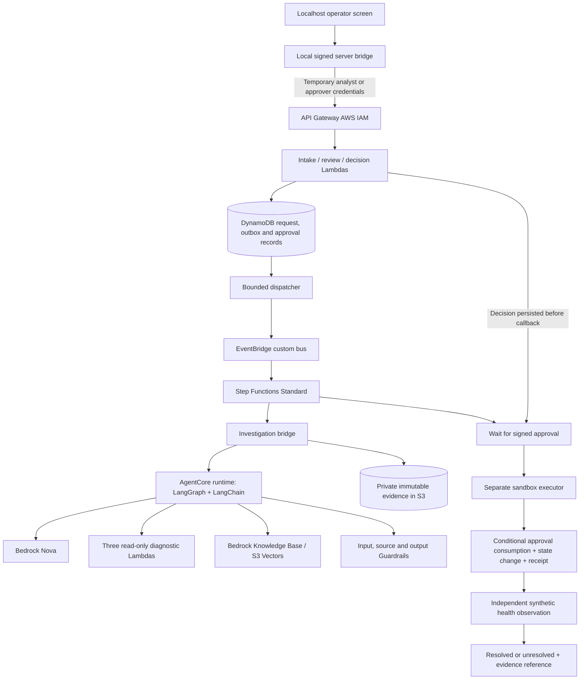
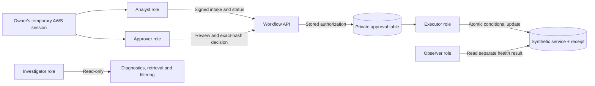

# Architecture and permissions

## Runtime responsibilities

Step Functions owns durable business state; LangGraph owns the bounded investigation.
The current cloud intake remains V1/Nova Lite. Saved P08 V2 results are a separate read-only
view. The localhost interface does not invoke AgentCore directly or deploy cloud changes.

## Authority boundaries

| Principal | Permitted responsibility | Boundary |
|---|---|---|
| Local browser | Display sources, submit explicit decisions | No AWS credentials or callback tokens |
| Analyst role | Signed incident intake and run reads | Cannot submit decisions |
| Approver role | Signed review and decision | Cannot invoke executor or send workflow callbacks directly |
| Investigator | Bounded model, diagnostics, retrieval and filtering | Cannot approve or execute rollback |
| Decision/recovery Lambdas | Persist/reconcile decision, deliver private callback | Callback delivery itself grants no action authority |
| Executor | Recheck exact proposal, identity, expiry and service version | One atomic synthetic mutation and durable receipt |
| Observer | Separate post-action health observation | Receipt alone is not recovery |

The two human roles currently trust the same owner's account role. Separately governed people
and identities would be needed for production separation of duties. The API's current access-log
limitation and retention/recovery controls are documented in the [P07 runbook](p07-live-runbook.md).
P07's [45 control checks and 33 deployment checks](p07-acceptance.md) establish the tested
boundaries; P09 does not claim to have repeated those live checks.
